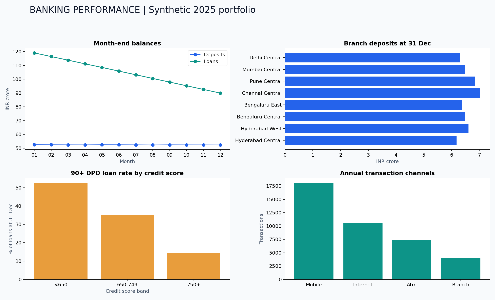

# Banking & Financial Performance Analytics

An end-to-end portfolio project by **Kavali Harshavardhan** using Python, SQLite, Excel, and Power BI build assets. All data is **synthetic**, generated reproducibly with seed 81. Reporting year: 2025. Currency: INR.



## Start here

1. Open `outputs/Banking_Dashboard.html` in Chrome or Edge. It works offline, without installation. Select a branch to filter the cards and table; choose the trend view to switch between balances and profit. Risk/channel charts and monthly trends show the whole portfolio and say so explicitly.
2. Open `outputs/Banking_Analytics.xlsx` for editable, formula-based financial summaries and charts.
3. Read `outputs/Banking_Analytics_Report.pdf` for findings, recommended actions, and modeling limits.
4. Follow `powerbi/BUILD_GUIDE.md` to create the native Power BI report. No `.pbix` is bundled: Power BI Desktop authoring and testing remain to be done.

## Reproduce in VS Code

Install Python 3.11+ and open this folder in VS Code. Open Terminal > New Terminal.

```bash
python -m venv .venv
```

Windows PowerShell:

```powershell
.venv\Scripts\Activate.ps1
python -m pip install -r requirements.txt
python src/pipeline.py
python tests/validate.py
```

macOS/Linux:

```bash
source .venv/bin/activate
python -m pip install -r requirements.txt
python src/pipeline.py
python tests/validate.py
```

The Python pipeline regenerates data, SQLite, query results, charts, PDF, and HTML. The bundled Excel is a finished deliverable; refreshing the Python pipeline does not overwrite the Excel workbook. Reimport the CSV summaries into Excel when changing the simulation. The optional workbook builder requires the ChatGPT artifact runtime, rather than an ordinary Python installation.

## Dataset and workflow

Raw data -> cleaning and quarantine -> SQLite tables -> SQL queries -> Python EDA -> KPIs -> branch/customer/loan analysis -> dashboards -> findings and recommendations -> report -> GitHub portfolio.

| Table | Grain | Rows |
|---|---|---:|
| branches | One branch | 8 |
| customers | One customer | 2,500 |
| accounts | One deposit account | 3,200 |
| transactions (clean) | One account transaction | 40,000 |
| loans | One loan | 1,200 |
| repayments | One scheduled monthly loan installment | 14,400 |
| account_snapshots | One account per month-end | 38,400 |
| loan_snapshots | One loan per month-end | 14,400 |
| branch_financials | One branch per month-end | 96 |

The raw transaction file has 40,115 rows. Cleaning removes 100 exact duplicates and quarantines 15 invalid rows. It normalizes 40 channel aliases and labels 20 missing occupations `Unknown`.

## Results

| Metric | Result |
|---|---:|
| Deposit balance at 31 December | INR 52.32 crore |
| Loan outstanding at 31 December | INR 89.98 crore |
| Loan-to-deposit ratio | 171.98% |
| 90+ DPD exposure ratio (proxy) | 35.99% |
| Digital transaction share | 71.71% |
| Annual net interest income | INR 7.24 crore |
| Annual operating profit before credit losses and tax | INR 6.31 crore |

The high delinquency rate is a result of this stress-style simulation, in which older missed installments remain unpaid. It is not an estimate of real Indian bank performance. No customer growth KPI is claimed: the customer population is fixed.

## What makes the analysis auditable

- Primary/foreign keys and grain are explicit. SQL preaggregates facts before joining to avoid multiplying balances by transaction counts.
- Stocks use the latest month-end; income and transactions sum over the reporting period. Monthly balances are never summed into an annual portfolio balance.
- Bank income is modeled separately from customer transaction amounts.
- Outstanding principal reconciles to original principal less principal paid. Deposits reconcile to opening balances plus signed transactions.
- All nine pipeline checks pass. `outputs/validation.json` and the standalone validator preserve the evidence.
- KPI definitions and assumptions are documented in `docs/KPI_DICTIONARY.md` and `docs/DATA_DICTIONARY.md`.

## Modeling limits

This is a cash-based management analytics simulation, not regulatory reporting. Loan payments use equal principal installments rather than fixed-EMI amortization. Missed payments remain unpaid; later installments do not cure earlier arrears. Fee and funding cost ledgers are modeled separately and are not posted to deposit accounts. Operating profit excludes credit-loss provisions and tax. A 90+ DPD metric is an educational proxy, not an asserted regulatory NPA or contractual default classification. The credit-score/risk association is partly programmed, so it is not a causal discovery.

## GitHub publication

Repository: [https://github.com/harshakavali81-collab/Banking-Financial-Performance-Analytics](https://github.com/harshakavali81-collab/Banking-Financial-Performance-Analytics). See `docs/GITHUB_SETUP.md` for cloning and updating this project.

## Power BI references

- [Microsoft: star schema guidance](https://learn.microsoft.com/en-us/power-bi/guidance/star-schema)
- [Microsoft: relationships](https://learn.microsoft.com/en-us/power-bi/transform-model/desktop-create-and-manage-relationships)
- [Microsoft: CALCULATE](https://learn.microsoft.com/en-us/dax/calculate-function-dax)

## Project structure

`src/` pipeline and dashboard template; `sql/` schema and ten analytical queries; `data/raw/`, `data/clean/`, `data/quarantine/`; `outputs/` finished artifacts, database, JSON evidence and query CSVs; `powerbi/` DAX, Power Query, theme and build guide; `notebooks/` EDA walkthrough; `tests/` standalone validation; `docs/` report, definitions, interview notes and GitHub instructions.
